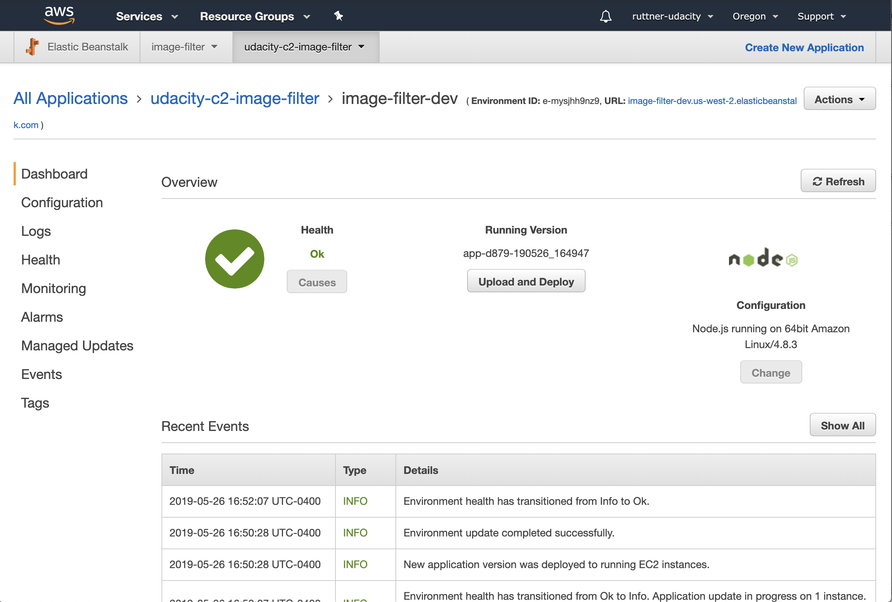

# Udagram Image Filtering Microservice

This is an image filtering service that accepts images publicly available and performs;

    -Resize
    -Sets quality to predefined 60
    -Set to grayscale

Then sends the new image back to the user and cleans the server

## Sample result

|                             # RAW INPUT                                   |                            # FILTERED OUTPUT                              |
---------------------------------------------------------------------------------------------------------------------------------------------------------
|   |   |
