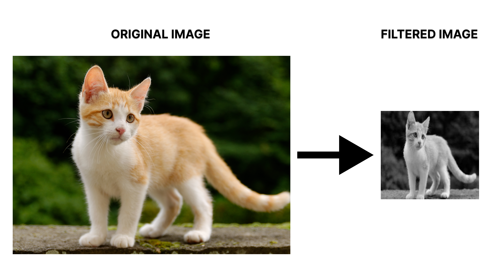
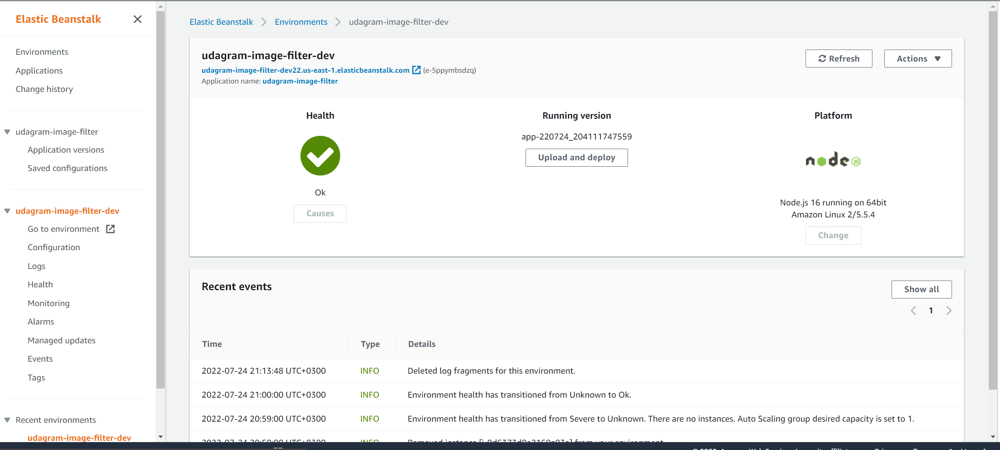

# Udagram Image Filtering Microservice

* This is an image filtering service that accepts images publicly available and performs:
    * Resize
    * Sets quality to predefined 60
    * Set to grayscale

Then sends the new image back to the user and cleans the server

### Deployment endpoint

[http://udagram-image-filter-dev22.us-east-1.elasticbeanstalk.com](http://udagram-image-filter-dev22.us-east-1.elasticbeanstalk.com)

## Sample result

## Elastic beanstalk deployment

